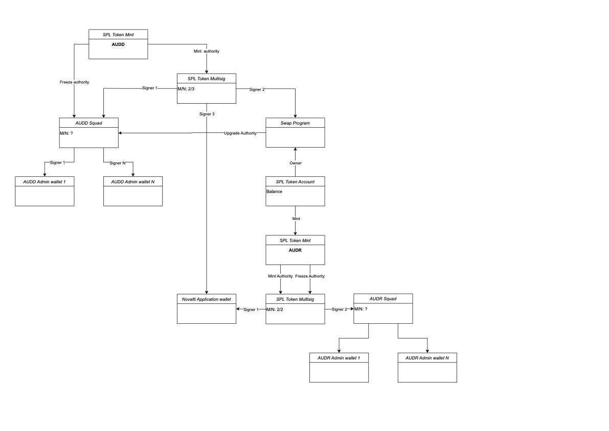

# AUDD-AUDR

## Description

This repo contains:

1. Utils (app/utils).

    Here you can find is a set of scripts that helps to manipulate on-chain entities.
2. Scenarios how to create & mint & swap tokens (app/scenarios).

    In this folder you can find scripts that combines methods from utils to cover scenarios like: create tokens with required structure, mint and swap them. Also there are scenarios for managing squads.
3. Swap program (programs/swap)

    This folder contains program written in rust to swap tokenA to tokenB

## Setup

It's required to install Rust, Solana, Yarn and Anchor. Details can be found here: <https://www.anchor-lang.com/docs/installation>

If you pulled repo for the first time you won't have `target/deploy` folder where program keys and build files are stored. Keys will be generated after `anchor build` command. But after that it'll be necessary to update program id in the codebase. To do this you need to run `anchor keys sync` several times(one run of this command won't fix all entries of the program id in Anchor.toml file)

After you set actual program id you can start creating tokens. But it's better to not change program id after you created AUDD token because it'll require to create new spl multisig account and transfer mint authority to this new spl multisig.

## Accounts structure

## Swap Program

Program has only one method(swap) that has inside two native spl-token instructions.
Swap instruction has only `amount` as an argument.

Instructions inside swap

1. Burn `amount` of token A from the sender's wallet (sender's wallet is a signer)
2. Mint `amount` of token B to the recipient's wallet (programPDA and app wallet are signers)

Usage example you can find in `app/scenarios/swapToken.ts` file

### First deploy

First you need to build program calling `anchor build`

`anchor deploy --program-name swap --program-keypair .keys/programs/swap/swap-keypair.json --provider.cluster devnet`

### Transfer upgrade authority to AUDD squad

Details of how to transfer upgrade authority you can find [here](https://docs.squads.so/squads-v3-docs/navigating-your-squad/developers/programs)

Note:

    Squads docs miss this nuance but it is necessary to use flag `--skip-new-upgrade-authority-signer-check` in `solana program set-upgrade-authority` command or use safe way of transfering authority that is described in Squads docs.

`solana program set-upgrade-authority <prodram id> --new-upgrade-authority <squad vault address> --skip-new-upgrade-authority-signer-check`

### Further deploys

Upgrade program flow is also described in [Squads docs](https://docs.squads.so/squads-v3-docs/navigating-your-squad/developers/programs#upgrade-a-program)

## Scenarios

### Create AUDD & Create AUDR

Creates AUDD and AUDR tokens according to the scheme in [accounts structure](#accounts-structure)

`CLUSTER_URL=devnet yarn ts-node scenarios/createAudd.ts`

`CLUSTER_URL=devnet yarn ts-node scenarios/createAudr.ts`

This scenarios requires 2 private keys in the keys folder at the root folder of the app:

1. Fee payer's wallet
2. Novatti app wallet

These PKs are fetched from the file system, but they can be fetched from a wallet like Phantom.

### Mint token

Mints 5 AUDD and 5 AUDR to wallets in scenario file.

    AUDD to `9gHCJSMWZAFvaLDa8aczr9NBH97gTaUf9czR7brXQ2y1`
    AUDR to `5S7YvvaEHcM65Kptznm7rsWauLcQMAnmpUVNAyMsnFXV`

`CLUSTER_URL=devnet yarn ts-node scenarios/mintTokens.ts`

This scenarios requires 3 private keys:

1. Fee payer's wallet
2. Novatti app wallet
3. Squad member's wallet for voting

### Swap token

Swaps 0.01 AUDR to 0.01 AUDD to wallets in scenario file.

    AUDR from `5S7YvvaEHcM65Kptznm7rsWauLcQMAnmpUVNAyMsnFXV`
    to AUDD `9gHCJSMWZAFvaLDa8aczr9NBH97gTaUf9czR7brXQ2y1`

`CLUSTER_URL=devnet yarn ts-node scenarios/swapTokens.ts`

This scenarios requires 3 private keys:

1. Fee payer's wallet
2. AUDR holder wallet
3. Squad member's wallet for voting

... In progress ...
# AUDD-SOLANA
